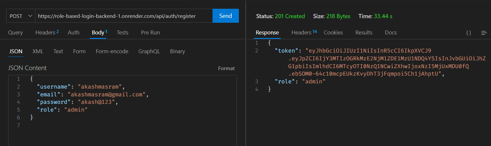

# 🌟 Role-Based Login Backend

## 🗂️ Index

- [Overview](#-overview)
- [Features](#-features)
- [Technologies Used](#-technologies-used)
- [Installation](#-installation)
- [Deployment](#-deployment)
- [API Endpoints](#-api-endpoints)

## 📖 Overview

Welcome to the **Role-Based Login Backend**! This is a Node.js application that implements role-based authentication using JWT (JSON Web Tokens). Users can register, log in, and their assigned roles (either **admin** or **user**) determine their access to different routes.

## ⭐ Features

- **User Registration**: Allows users to create a new account.
- **User Login**: Authenticates users and generates JWT tokens.
- **Role-Based Access Control**: Restricts access to specific routes based on user roles.
- **Token-Based Authentication**: Secures access to routes using JWT tokens.

## 🛠️ Technologies Used

The project is built with the following technologies:

- **Node.js**: JavaScript runtime for building server-side applications.
- **Express.js**: Web application framework for Node.js.
- **MongoDB**: NoSQL database (using [MongoDB Atlas](https://www.mongodb.com/cloud/atlas)).
- **Mongoose**: Object Data Modeling (ODM) library for MongoDB and Node.js.
- **JSON Web Tokens (JWT)**: Standard for securely transmitting information between parties as a JSON object.
- **Bcrypt.js**: Library to hash passwords for security.

## 🚀 Installation

To run this project locally, follow the steps below:

1. **Clone the Repository**:

   ```bash
   git clone https://github.com/srajiv9496/role-based-login-backend.git
   cd role-based-login-backend

2. **Install Dependencies**:

   ```bash
   npm install

3. **Set Up Environment Variables**:

   Create a `.env` file in the root directory and add the following variables:

   ```bash
   JWT_SECRET=your_jwt_secret_key
   MONGODB_URI=your_mongodb_connection_string

4. **Start the Application**:

   You can start the application using one of the following commands:

   ```bash
   node app.js


## 🌐 Deployment

This application can be easily deployed on Render. Follow these steps for deployment:

1. **Sign Up / Log In**:

   Create an account or log in to Render.

2. **Create a New Web Service**:

   - Click on the **New** button and select **Web Service**.
   - Connect your GitHub repository by authorizing Render.

3. **Configure the Service**:

   - Select your repository and branch (e.g., main).
   - Choose **Node** as the environment.

   - In the **Build Command** field, enter:

     ```bash
     npm install
     ```

   - In the **Start Command** field, enter:

     ```bash
     node app.js
     ```

4. **Set Environment Variables**:

   Add `JWT_SECRET` and `MONGODB_URI` in the environment variables section.

5. **Deploy**:

   Click **Create Web Service** to begin the deployment.
   

## 🧪 Testing the API

You can test the APIs using the following links:

- **Register User**: [https://role-based-login-backend-1.onrender.com/api/auth/register](https://role-based-login-backend-1.onrender.com/api/auth/register)
- **Login User**: [https://role-based-login-backend-1.onrender.com/api/auth/login](https://role-based-login-backend-1.onrender.com/api/auth/login)
- **Access Admin Route**: [https://role-based-login-backend-1.onrender.com/api/auth/admin](https://role-based-login-backend-1.onrender.com/api/auth/admin)
- **Access User Route**: [https://role-based-login-backend-1.onrender.com/api/auth/user](https://role-based-login-backend-1.onrender.com/api/auth/user)


## 📡 API Endpoints

Here are the available API endpoints for this application:

1. **Register User**

   - **Endpoint**: `POST /api/auth/register`
   - **Request Body**:

     ```json
     {
       "username": "your_username",
       "email": "your_email@example.com",
       "password": "your_password",
       "role": "user" // or "admin"
     }
     ```
     ***user*** 
     ***admin***

2. **Login User**

   - **Endpoint**: `POST /api/auth/login`
   - **Request Body**:

     ```json
     {
       "email": "your_email@example.com",
       "password": "your_password"
     }
     ```

     ***user***
     ***admin***

3. **Access Admin Route**

   - **Endpoint**: `GET /api/auth/admin`
   - **Headers**:

     ```
     Authorization: Bearer your_jwt_token
     ```

     

4. **Access User Route**

   - **Endpoint**: `GET /api/auth/user`
   - **Headers**:

     ```
     Authorization: Bearer your_jwt_token
     ```
   

